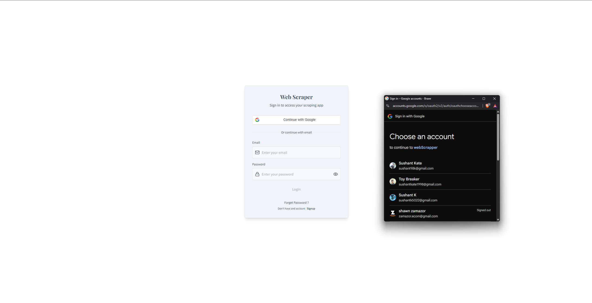
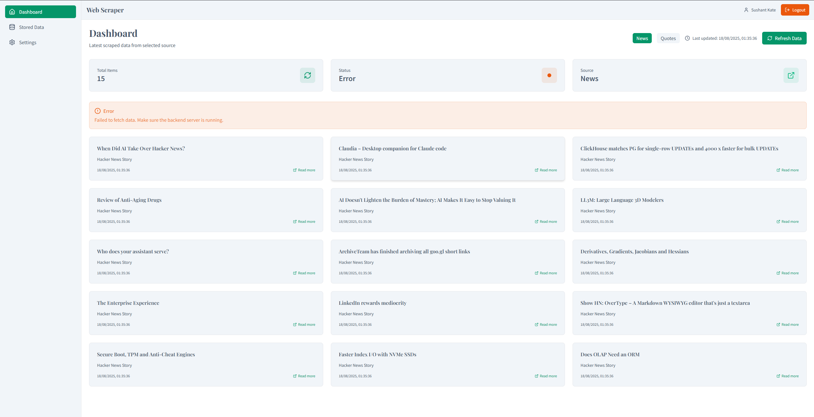
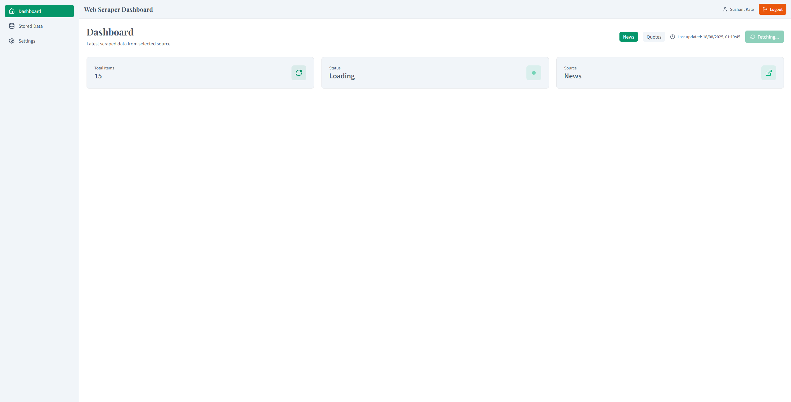
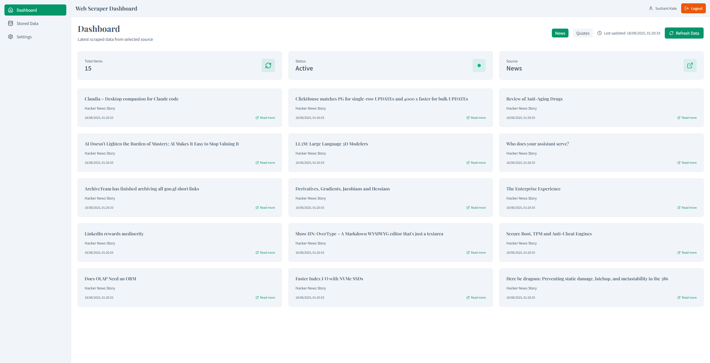

# Web Scraper (News)

A full-stack web scraping application built with React (Vite + Tailwind CSS) frontend and FastAPI backend. Features Google OAuth authentication, real-time data fetching, and a responsive dashboard for displaying scraped content.

## 🚀 Features

- **Modern Frontend**: React with Vite, Tailwind CSS v4, and responsive design
- **Secure Authentication**: Google OAuth 2.0 integration with JWT tokens
- **Web Scraping**: Ethical scraping from public websites (Hacker News, BBC News)
- **Real-time Updates**: Live data fetching with loading states and error handling
- **Professional UI**: Clean, modern interface with semantic design tokens
- **API Protection**: JWT-protected endpoints for secure data access

## 📋 Prerequisites

- **Node.js** (v21 or higher)
- **Python** (v3.12 or higher)
- **Google Cloud Account** (for OAuth setup)

## 🛠️ Quick Start

### 1. Clone the Repository

```bash
git clone `https://github.com/Sushant98K/Web-Scrapper.git`
cd web-scraper
```

### 2. Backend Setup

```bash
cd backend

# Create virtual environment
python 3.12 -m venv venv

# Activate virtual environment
# On Windows:
venv\\Scripts\\activate

# On macOS/Linux:
source venv/bin/activate

# Install dependencies
pip install -r requirements.txt

# Copy environment template
cp .env.example .env

# Edit .env with your Google OAuth credentials
# See GOOGLE_OAUTH_SETUP.md for detailed instructions

# Start the server
python run.py
```

Backend will be available at: `http://localhost:8000`

### 3. Frontend Setup


``` bash
cd frontend

# Install dependencies
npm install

# Copy environment template
cp .env.example .env

# Edit .env with your Google Client ID

# Start development server
npm run dev
```

Frontend will be available at: `http://localhost:5173`

## 📁 Project Structure

``` bash

web-scraper-app/
├── backend/                 # FastAPI backend
│   ├── main.py             # Main application file
│   ├── auth.py             # Authentication logic
│   ├── requirements.txt    # Python dependencies
│   ├── .env               # Environment variables
│   ├── run.py             # Server startup script
│   ├── start.sh           # Setup and start script
│   └── test_scraper.py    # API testing script
├── frontend/               # React frontend
│   ├── src/
│   │   ├── components/    # React components
│   │   ├── App.jsx        # Main app component
│   │   ├── main.jsx       # Entry point
│   │   └── index.css      # Tailwind styles
│   │── context/           # React context providers
│   ├── package.json       # Node dependencies
│   ├── vite.config.js     # Vite configuration
│   ├── .env              # Environment variables
│   └── index.html        # HTML template
├── README.md              # This file
├── GOOGLE_OAUTH_SETUP.md  # OAuth setup guide
├── PROJECT_SETUP.md  # Project setup guide
├── TROUBLESHOOTING.md  # Troubleshooting guide

```

## 🔐 Authentication Setup

1. **Google OAuth Configuration**: Follow the detailed guide in `GOOGLE_OAUTH_SETUP.md`
2. **Environment Variables**: Configure both backend and frontend `.env` files
3. **JWT Secret**: Generate a secure random string for JWT signing

## 🛡️ Security Features

- Google OAuth 2.0 authentication
- JWT token-based sessions
- Protected API endpoints
- CORS configuration
- Input validation and sanitization
- Ethical web scraping practices

## 📝 Development Notes

- **Ethical Scraping**: Respects robots.txt and rate limits
- **Error Handling**: Comprehensive error handling throughout the application
- **Responsive Design**: Mobile-first approach with Tailwind CSS
- **Modern Stack**: Latest versions of all dependencies
- **Type Safety**: JSX with proper prop validation

## 🤝 Contributing

1. Fork the repository
2. Create a feature branch
3. Make your changes
4. Test thoroughly
5. Submit a pull request

## 📄 License

This project is licensed under the MIT License.

## 🆘 Support

If you encounter any issues:
1. Check the troubleshooting section in `./TROUBLESHOOTING.md`
2. Verify your environment variables
3. Ensure all dependencies are installed
4. Check the console for error messages

## 🔗 Links

- **Frontend**: http://localhost:5173
- **Backend API**: http://localhost:8000
- **API Docs**: http://localhost:8000/docs
- **Interactive API**: http://localhost:8000/redoc

## Screenshots 📸








